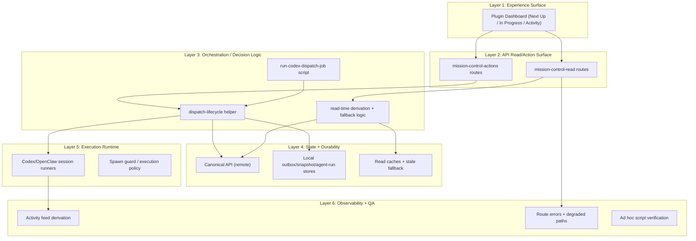
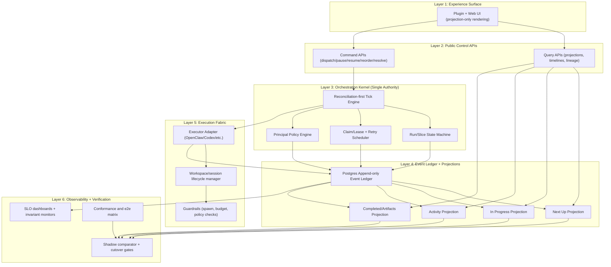

# OrgX FSD Orchestrator Architecture v1

Last updated: 2026-03-05  
Status: Approved blueprint (implementation pending full migration)  
Owners: OrgX orchestration, plugin runtime, dashboard UX

## Summary

This blueprint defines a single-authority orchestration architecture for OrgX that eliminates lifecycle split-brain between Next Up, In Progress, Activity, and Completed.

Core design choice:

- `Code/orgx` owns orchestration truth (state machine + reconciliation + retry + projections)
- Plugin becomes an edge runtime (command issuer + projection renderer)
- Event ledger + deterministic projections become the canonical data model

Rollout strategy:

- Shadow -> Verify -> Cutover

## Current 6-Layer Architecture



### Current failure profile

1. Lifecycle truth is fragmented across canonical, local fallback, and cache-derived read paths.
2. Queue/running counts can diverge between Mission Control panels.
3. Internal/system sessions can leak into user-facing In Progress cards.
4. State labels (`active`, `running`, `queued`, `paused`) are not consistently normalized.
5. Commands can appear accepted while projection transitions lag or fail opaquely.

## Target 6-Layer Architecture



## Layer-by-Layer Detailed Contract

## Layer 1: Experience Surface

Rules:

1. UI does not derive lifecycle from raw events.
2. UI renders only projection rows with canonical state fields.
3. Every card carries lineage IDs (`slice_id`, `run_id`, `initiative_id`, `workstream_id`, `milestone_id`).
4. Command confirmation and projection confirmation are separated in UX:
   - command accepted (immediate acknowledgment)
   - projection confirmed (state transition complete)

Required read models:

- `next_up_items[]`
- `in_progress_runs[]`
- `activity_timeline[]`
- `completed_items[]`

## Layer 2: Public Control APIs

### Command endpoint

`POST /api/orchestrator/commands`

```json
{
  "command_id": "uuid",
  "type": "dispatch_slice|pause_slice|resume_slice|reorder_queue|resolve_decision|toggle_autopilot",
  "issued_by": "user_id",
  "scope": {
    "workspace_id": "uuid",
    "initiative_id": "uuid",
    "slice_id": "uuid"
  },
  "payload": {},
  "idempotency_key": "string"
}
```

### Query endpoints

- `GET /api/orchestrator/projections/next-up`
- `GET /api/orchestrator/projections/in-progress`
- `GET /api/orchestrator/projections/activity`
- `GET /api/orchestrator/projections/completed`
- `GET /api/orchestrator/runs/{run_id}/lineage`

Requirements:

1. Commands return `accepted|rejected`, never inferred completion.
2. Command processing emits event chain (`received`, `applied|rejected`).
3. Query envelope includes `as_of_offset` and `projection_version`.

## Layer 3: Orchestration Kernel

### Canonical slice state machine

`queued -> dispatching -> running -> blocked|paused|failed|completed -> archived`

### Canonical run state machine

`created -> starting -> active -> stalled|blocked|failed|completed|canceled`

### Invariants

1. One active run per slice at most.
2. `queued` slices cannot appear in In Progress projection.
3. `running` slices must have non-terminal run row with lease.
4. `completed` requires terminal run and completion event.

### Reconciliation-first tick order

1. Reconcile active runs against executor truth.
2. Process lease expiry and stale claims.
3. Process due retries.
4. Pull dispatch candidates.
5. Dispatch according to policy and slot limits.
6. Trigger projection refresh pipeline.

### Retry model

- Delay: `min(base * 2^attempt, max_backoff)`
- Typed reasons:
  - `executor_unreachable`
  - `policy_blocked`
  - `resource_throttle`
  - `dependency_unmet`
  - `unknown_error`

## Layer 4: Event Ledger + Projections

### Core tables

- `orchestrator_events`
- `orchestrator_commands`
- `orchestrator_claims`
- `orchestrator_retries`

Projection tables:

- `projection_next_up`
- `projection_in_progress`
- `projection_activity`
- `projection_completed`

Projection guarantees:

1. deterministic rebuild from ledger produces identical projection state
2. every row has `as_of_offset`
3. lag is observable and queryable

## Layer 5: Execution Fabric

Executor contract:

```ts
interface ExecutorAdapter {
  startRun(input): Promise<{ executor_run_id: string }>;
  stopRun(input): Promise<void>;
  getRunStatus(input): Promise<{
    state: "starting" | "active" | "completed" | "failed" | "blocked" | "stalled";
    heartbeat_at?: string;
    progress?: number;
    message?: string;
    tokens?: { in: number; out: number };
  }>;
}
```

Requirements:

1. heartbeat <= 15s while active
2. status changes emit normalized events
3. internal/system sessions are flagged and excluded from user projections by default

## Layer 6: Observability + Verification

SLO targets:

1. command acknowledgment p95 < 150ms
2. command-to-projection transition p95 < 300ms
3. Next Up -> In Progress continuity >= 99.9%
4. running count mismatch < 0.1%

Alerts:

1. projection running count differs from active run count
2. running without heartbeat > 30s
3. accepted command without transition in 5s
4. projection lag > 1s sustained

## Principal Policy Engine (Operator-level reasoning)

Policy split:

1. principles (hard constraints)
2. tactics (bounded adjustments)
3. execution (mechanical dispatch)

Example policy contract (`orchestrator-policy.yaml`):

```yaml
version: 1
principles:
  - id: continuity_first
    weight: 1.0
  - id: dependency_integrity
    weight: 1.0
  - id: evidence_before_progress_claim
    weight: 1.0
dispatch:
  max_parallel_by_scope:
    initiative: 3
    workstream: 1
  preconditions:
    require_dependency_clear: true
    require_budget_ok: true
  tie_breakers:
    - queue_rank
    - priority
    - age
review:
  blocker_escalation_threshold: high
  auto_resolve_low_risk: true
```

Learning loop:

1. Capture operator override events.
2. Train bounded rank adjustment model.
3. Never allow learned policy to violate principle constraints.

## Migration Plan

## Phase 0 (Week 0-1): Contract and shadow wiring

Deliverables:

1. schema migrations for ledger/projections
2. command/query API contracts
3. shadow comparator endpoint

## Phase 1 (Week 2-3): Kernel and reconciliation

Deliverables:

1. tick engine + claims/leases + retries
2. run/slice state machine
3. executor adapter contract

## Phase 2 (Week 4-5): Projection cutover

Deliverables:

1. projection endpoints wired to UI
2. legacy derivation paths behind emergency fallback flag

## Phase 3 (Week 6): Policy hardening and deprecation

Deliverables:

1. policy engine v1
2. override telemetry path
3. legacy split-brain path removal

## Acceptance Criteria

1. single lifecycle authority in `Code/orgx`
2. deterministic continuity across Next Up, In Progress, Activity, Completed
3. shadow gates passed for 7-day verification window
4. invariant, contract, chaos, and e2e suites green
5. rollback toggles available and tested

